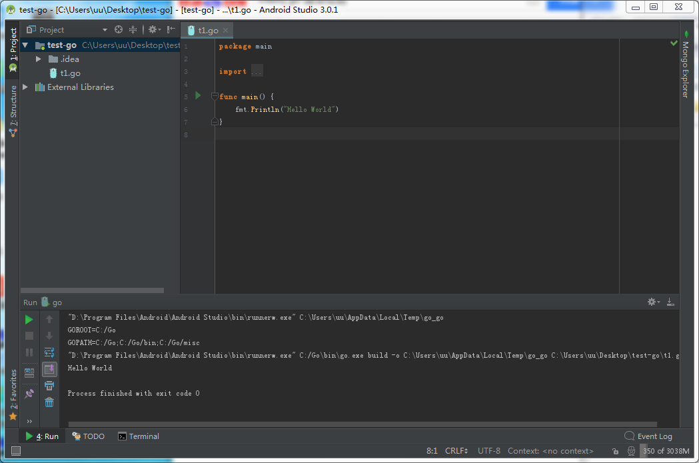

<!--  -->

 Android studio for golang  

<!---more--->

1. install go language plugin and restart.

2. open project

3. change module type to Go and reload project

4. set Go Libraries

5. set go sdk

6. set application and run

that's all.
